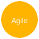

<h1 style="text-align:left;">MUHAMMAD TAHIR</h1>

Backend Software Engineer

  
  
  

A backend-focused Software Engineer from Mehran University of Engineering & Technology (MUET) specializing in building reliable, secure Java-based server-side systems using Spring Boot, RESTful APIs, Spring Security, Spring Data JPA, and JDBC/MySQL. I design layered architectures with clear separation of concerns, prioritize data integrity and security, and enjoy turning complex backend requirements into maintainable, well-tested solutions.

---

## Technical Skills

Below are quick visual badges for my core languages, frameworks, databases, tools and core concepts. Icons are circular and sized for high-DPI displays.

  <!-- Languages -->
  

    <h3 style="margin:0; font-size:20px;">Languages</h3>
    

      
      
      
      
      
      
    

  

  <!-- Frameworks & Libraries -->
  

    <h3 style="margin:0; font-size:20px;">Frameworks & Libraries</h3>
    

      
      
      
      
    

  

  <!-- Databases & Data -->
  

    <h3 style="margin:0; font-size:20px;">Databases & Data</h3>
    

      
      
      
    

  

  <!-- Tools & Platforms -->
  

    <h3 style="margin:0; font-size:20px;">Tools & Platforms</h3>
    

      
      
      
      
      
      
      
      
      
    

  

  <!-- Concepts -->
  

    <h3 style="margin:0; font-size:20px;">Concepts</h3>
    

      
      
      
      
      
      
    

  

